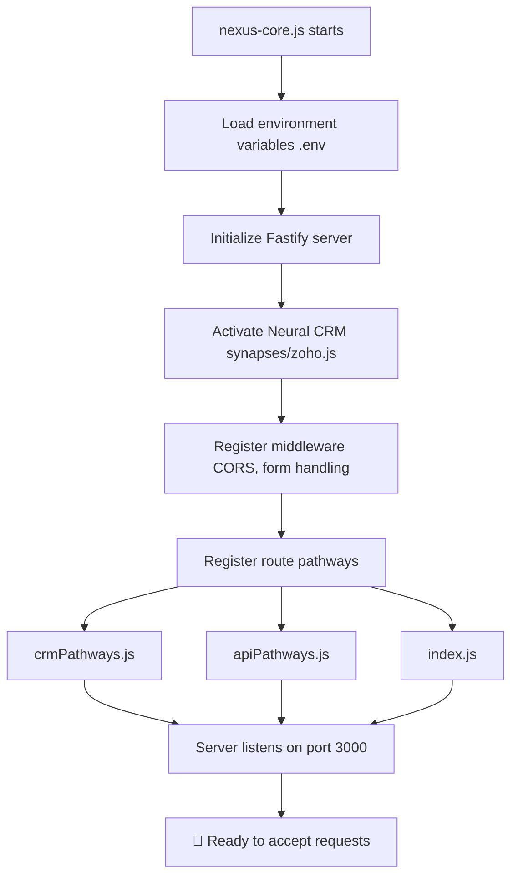
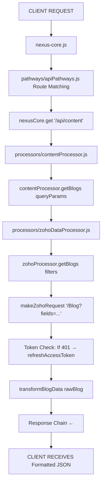
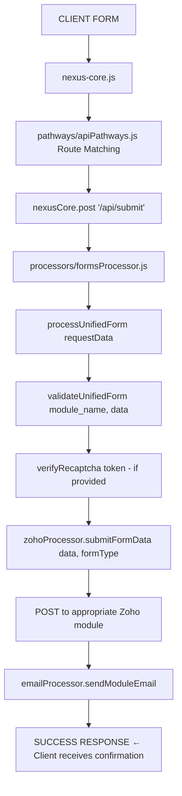
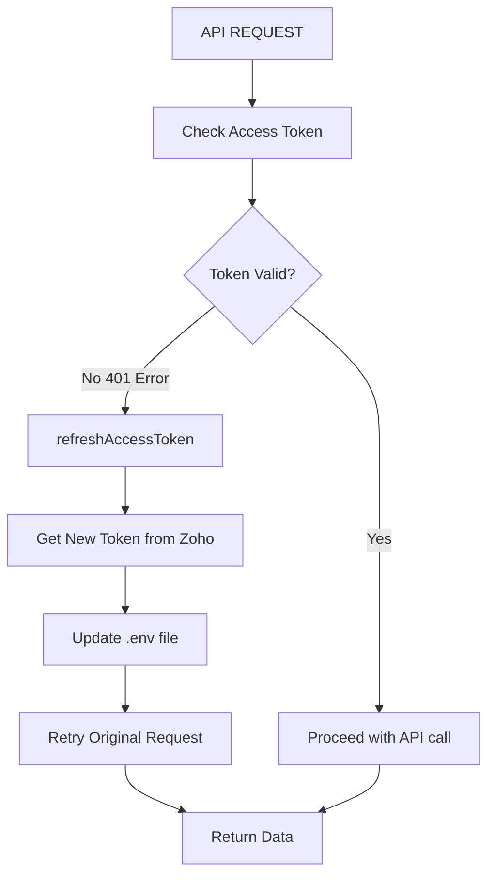
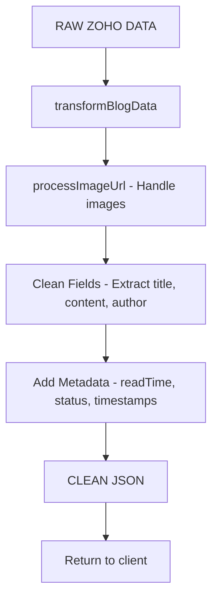
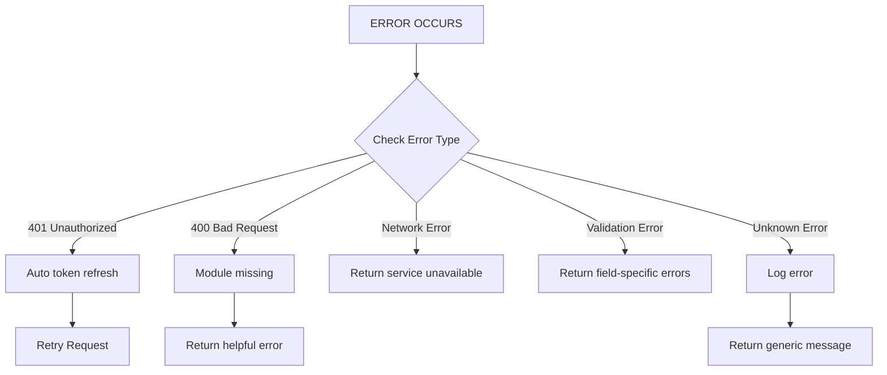

# 🧠 NEXUS Backend Architecture - Complete Code Flow Documentation

## 📋 Table of Contents
1. [Project Overview](#project-overview)
2. [Directory Structure](#directory-structure)
3. [Server Startup Flow](#server-startup-flow)
4. [API Request Flows](#api-request-flows)
5. [Data Processing Pipeline](#data-processing-pipeline)
6. [Error Handling Strategy](#error-handling-strategy)
7. [File Path Journey Maps](#file-path-journey-maps)
8. [Key Components Deep Dive](#key-components-deep-dive)
9. [Integration Points](#integration-points)
10. [Performance & Scalability](#performance--scalability)

---

## 🏗️ Project Overview

**Project Name**: `nexus-backend-architecture`  
**Main Technology**: Node.js with Fastify framework  
**Primary Integration**: Zoho CRM  
**Architecture Pattern**: Neural-inspired distributed processing  
**Main Entry Point**: `nexus-core.js`

---

## 🗂️ Directory Structure

### **Core System Files (Root Level)**
```
/nexus-core.js                 # Main application entry point (141 lines)
/package.json                  # Dependencies & project metadata (76 lines)
/package-lock.json             # Dependency lock file
/.env                          # Environment variables (not tracked)
/.gitignore                    # Git ignore rules
```

### **Data Processing Layer (`/processors/`)**
```
/processors/
├── zohoDataProcessor.js       # ⭐ Main Zoho CRM integration (670 lines)
├── contentProcessor.js        # Content management logic (519 lines)
├── emailProcessor.js          # Email handling system (358 lines)
├── formsProcessor.js          # Form submission processing (248 lines)
└── crmProcessor.js           # General CRM operations (175 lines)
```

### **API Routing Layer (`/pathways/`)**
```
/pathways/
├── apiPathways.js            # Main API routes & endpoints (1038 lines)
├── crmPathways.js            # CRM-specific routes (289 lines)
└── index.js                  # Route registration (45 lines)
```

### **Integration Layer (`/synapses/`)**
```
/synapses/
├── zoho.js                   # Zoho connection setup (146 lines)
└── server.js                 # Server configuration (21 lines)
```

### **Utility & Security Layer**
```
/utilities/
└── cacheBuster.js            # Cache management (240 lines)

/toolkit/
└── validation.js             # Input validation & XSS protection (117 lines)

/interceptors/                # Currently empty - for future middleware
```

### **Documentation**
```
/ARCHITECTURE.md              # Complete system architecture (1270 lines)
/README.md                    # Project overview & setup (347 lines)
/ZOHO_CRM_IMPLEMENTATION.md   # Zoho integration guide (387 lines)
/ZOHO_MODULES_SETUP.md        # Zoho module configuration (455 lines)
/ZOHO_FIELDS_MANAGEMENT.md    # Field mapping guide (385 lines)
/API_SETUP_GUIDE.md           # API setup instructions (201 lines)
/ENV_TEMPLATE.md              # Environment configuration (83 lines)
/COMMANDS.md                  # Available npm commands (90 lines)
```

---

## 🚀 Server Startup Flow



### **Startup Sequence Details**
1. **Environment Loading**: Loads `.env` variables for Zoho tokens and config
2. **Fastify Initialization**: Creates high-performance HTTP server instance
3. **CRM Activation**: Tests Zoho connection and initializes processors
4. **Middleware Registration**: CORS for cross-origin requests, form body parsing
5. **Route Registration**: Maps URL patterns to handler functions
6. **Server Binding**: Listens on all interfaces (0.0.0.0:3000)
7. **Health Check**: Validates all systems are operational

---

## 📊 API Request Flows

### **1. Content API Request Flow**
**Example**: `GET /api/content?blog=true`



### **Code Implementation**:
```javascript
// 1. Request arrives at apiPathways.js:47
nexusCore.get('/api/content', async (request, reply) => {
    const { blog, query } = request.query;
    
    // 2. Determine content type
    if (blog === 'true') {
        // 3. Call ContentProcessor
        result = await contentProcessor.getBlogs(filters);
    }
});

// 4. ContentProcessor.getBlogs() processes request  
async getBlogs(queryParams) {
    const filters = { page, limit, category, tag };
    
    // 5. Call ZohoDataProcessor
    const result = await this.zohoProcessor.getBlogs(filters);
    
    // 6. Apply client-side filtering if needed
    if (filterCategoryType) {
        filteredBlogs = result.blogs.filter(blog => 
            blog.categoryType.toLowerCase() === filterCategoryType.toLowerCase()
        );
    }
}

// 7. ZohoDataProcessor.getBlogs() handles Zoho integration
async getBlogs(filters = {}) {
    let endpoint = `/Blog?fields=Blog_Title,Content,Author...`;
    
    // 8. Make authenticated API call to Zoho
    const response = await this.makeZohoRequest(endpoint);
    
    // 9. Transform raw Zoho data
    return {
        blogs: response.data.map(blog => this.transformBlogData(blog)),
        total: response.info.count
    };
}
```

### **2. Form Submission Flow**
**Example**: `POST /api/submit` (Contact Form)



### **Code Implementation**:
```javascript
// 1. Form submission arrives
nexusCore.post('/api/submit', async (request, reply) => {
    // 2. Process through FormsProcessor  
    const result = await formsProcessor.processUnifiedForm(request.body);
});

// 3. FormsProcessor validates and routes
async processUnifiedForm(requestData) {
    const { module_name, ...data } = requestData;
    
    // 4. Validate form data
    const validation = this.validateUnifiedForm(module_name, data);
    
    // 5. Submit to Zoho CRM
    const zohoResult = await this.zohoProcessor.submitFormData(data, module_name);
    
    // 6. Send confirmation email
    await this.emailProcessor.sendModuleEmail(data, module_name);
}
```

---

## 🔄 Data Processing Pipeline

### **Token Management Flow**


### **Data Transformation Flow**


### **Key Transformation Methods**:
```javascript
// ZohoDataProcessor.js - Main transformation methods
transformBlogData(rawBlog) {
    const processedImageUrl = this.processImageUrl(rawBlog.featuredImage);
    return {
        id: rawBlog.id,
        title: rawBlog.Blog_Title || 'Untitled',
        slug: rawBlog.Blog_Slug,
        content: rawBlog.Content,
        author: rawBlog.Author,
        featuredImage: processedImageUrl,
        readTime: rawBlog.Read_Time_Minutes || 5,
        // ... additional fields
    };
}

processImageUrl(imageUrl) {
    // Handle Image Upload field (when imageUrl is an object or array)
    if (typeof imageUrl === 'object') {
        // Process Zoho-specific image formats
        if (firstImage.File_Id__s) {
            imageUrl = `https://www.zohoapis.in/crm/v8/files/${firstImage.File_Id__s}/content`;
        }
    }
    return this.optimizeImageUrl(cleanUrl);
}
```

---

## 🚨 Error Handling Strategy



### **Error Handling Implementation**:
```javascript
// Automatic token refresh on 401
if (response.status === 401) {
    console.log('🔄 Access token expired, refreshing...');
    await this.refreshAccessToken();
    
    // Retry the request with new token
    const retryResponse = await fetch(url, {
        headers: { 'Authorization': `Zoho-oauthtoken ${this.accessToken}` }
    });
    return await retryResponse.json();
}

// Module missing error handling
if (error.message && error.message.includes('400 Bad Request')) {
    return {
        success: true,
        data: [],
        message: 'Blog module not created in Zoho CRM yet'
    };
}
```

---

## 🗺️ File Path Journey Maps

### **Blog Request Journey**
```
📁 REQUEST PATH:
nexus-core.js (Entry Point)
  ↓
pathways/apiPathways.js (Routing Layer)
  ↓  
processors/contentProcessor.js (Business Logic)
  ↓
processors/zohoDataProcessor.js (Data Retrieval)
  ↓
synapses/zoho.js (Connection Config)
  ↓
ZOHO CRM API (External Service)
  ↓
Transform & Return (Response Chain)
```

### **Form Submission Journey**
```
📁 SUBMISSION PATH:
nexus-core.js (Entry Point)
  ↓
pathways/apiPathways.js (Form Endpoint)
  ↓
processors/formsProcessor.js (Validation & Processing)
  ↓
toolkit/validation.js (Input Sanitization)
  ↓
processors/zohoDataProcessor.js (CRM Submission)
  ↓
processors/emailProcessor.js (Notifications)
  ↓
Success Response (Client Confirmation)
```

---

## 🔍 Key Components Deep Dive

### **1. nexus-core.js (Main Entry Point)**
**Purpose**: Application bootstrap & server initialization
**Key Features**:
- Fastify server setup with high-performance configuration
- Middleware registration (CORS, form handling) 
- Route registration from pathway modules
- Health monitoring and system diagnostics
- Graceful shutdown handling for production stability

### **2. processors/zohoDataProcessor.js (Core Integration)**
**Purpose**: Complete Zoho CRM integration layer
**Key Features**:
- **Token Management**: Automatic refresh of expired tokens
- **Data Fetching**: Blogs, Case Studies, Media from CRM modules
- **Form Routing**: Direct form submissions to appropriate modules
- **Image Processing**: Advanced handling of Zoho image fields
- **Error Recovery**: Robust error handling with intelligent fallbacks

**Main Methods**:
```javascript
// Auto-refresh expired tokens
refreshAccessToken()

// Generic API request handler with retry logic  
makeZohoRequest(endpoint, options)

// Content retrieval methods
getBlogs(filters)
getCaseStudies(filters)  
getMedia(filters)

// Form submission routing
submitFormData(formData, formType)

// Data transformation pipeline
transformBlogData(rawBlog)
transformCaseStudyData(rawCaseStudy)
transformMediaData(rawMedia)
```

### **3. pathways/apiPathways.js (API Layer)**
**Purpose**: RESTful API endpoint definitions
**Main Endpoints**:
- `GET /api/content` - Unified content retrieval API
- `POST /api/submit` - Universal form submission endpoint
- `GET /api/getPost` - Single post retrieval with multi-category support
- `GET /health` - Comprehensive system health diagnostics

### **4. processors/formsProcessor.js (Form Handling)**
**Purpose**: Unified form processing with validation
**Key Features**:
- **Multi-form Support**: Handles careers, contacts, newsletters, ebook requests
- **Validation Pipeline**: Input sanitization and XSS protection
- **reCAPTCHA Integration**: Google reCAPTCHA verification
- **Email Notifications**: Automatic confirmation emails
- **CRM Integration**: Direct submission to appropriate Zoho modules

---

## 🔗 Integration Points

### **Zoho CRM Integration**
```javascript
// Connection Configuration
baseUrl: 'https://www.zohoapis.in/crm/v8'
modules: {
    blogs: 'Blog',
    case_studies: 'Case_Study',
    media: 'Medium',
    contacts: 'Contacts',
    leads: 'Leads',
    careers: 'Careers',
    newsletter: 'Newsletter'
}
```

### **Authentication Flow**
```javascript
// Token refresh mechanism
async refreshAccessToken() {
    const response = await fetch('https://accounts.zoho.in/oauth/v2/token', {
        method: 'POST',
        body: `refresh_token=${this.refreshToken}&client_id=${this.clientId}&client_secret=${this.clientSecret}&grant_type=refresh_token`
    });
    
    const data = await response.json();
    this.accessToken = data.access_token;
    await this.updateEnvFile(data.access_token);
}
```

---

## ⚡ Performance & Scalability

### **Optimization Strategies**
1. **Async/Await Pattern**: All operations are non-blocking
2. **Connection Pooling**: Reused HTTP connections to Zoho
3. **Client-side Filtering**: Reduces API calls for category filtering
4. **Image Optimization**: Intelligent image URL processing
5. **Error Caching**: Prevents repeated failed requests

### **Scalability Features**
1. **Modular Architecture**: Easy to add new processors/pathways
2. **Stateless Design**: No server-side session dependencies
3. **Environment Flexibility**: Configurable for different deployment environments
4. **Health Monitoring**: Built-in system diagnostics for monitoring

---

## 🎯 Quick Commands for Testing

```bash
# Start the server
npm start

# Development mode with auto-reload
npm run dev

# System health check
npm run health

# Test CRM connection
npm run crm

# View all available endpoints
curl http://localhost:3000/

# Test blog API
curl http://localhost:3000/api/content?blog=true

# Test form submission
curl -X POST http://localhost:3000/api/submit \
  -H "Content-Type: application/json" \
  -d '{"module_name":"contacts","firstName":"Test","lastName":"User","organisation":"Company","typeOfOrganisation":"Tech","country":"India","email":"test@example.com","message":"Hello NEXUS!","privacyPolicy":true}'
```

---

## 💡 Key Architectural Benefits

### **For Development Team**
1. **Clean Separation**: Routes → Business Logic → Data Layer → External APIs
2. **Predictable Flow**: Every request follows the same pattern
3. **Maintainable Code**: Each layer has a single responsibility
4. **Easy Testing**: Modular design allows isolated unit testing

### **For Operations Team**
1. **Auto-Recovery**: Token refresh happens automatically on failures
2. **Robust Error Handling**: System doesn't crash, provides helpful error messages
3. **Health Monitoring**: Built-in diagnostics for system status
4. **Production Ready**: Comprehensive logging and error tracking

### **For Business Team**
1. **Unified API**: Single endpoint handles all content types
2. **Real-time Integration**: Direct connection to Zoho CRM
3. **Form Flexibility**: Easy to add new form types without code changes
4. **Content Management**: Full control through Zoho CRM interface

---

## 📈 Future Enhancement Opportunities

1. **Caching Layer**: Redis integration for improved performance
2. **Rate Limiting**: API throttling for production stability  
3. **Webhook Support**: Real-time updates from Zoho CRM
4. **Multi-tenant Support**: Handle multiple Zoho organizations
5. **GraphQL API**: Alternative API interface for complex queries

---

*This documentation represents the complete code flow and architecture of the NEXUS Backend Framework. For technical implementation details, refer to the individual component documentation files.* 